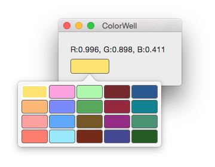

ColorWell
-----------



A color well implementation similar to iWork, inspired by [DFColorWell](https://github.com/danieljfarrell/DFColorWell).

All custom drawing is done using layers, the usual `NSEvent` methods (`mouseDown:`, `mouseUp:`) are implemented to keep track of the control's state and turn on/off different drawing options. Colors can only be selected from a predefined set of colors (provided by your data source), unlike [DFColorWell](https://github.com/danieljfarrell/DFColorWell). 

I initially created this component for my app [Ceceree](https://ceceree.com). I ended up using a slightly different version in the final app, but this is still the basis.

Usage
-----

1. Drag an NSView into your XIB or Storyboard
2. Change the class to `ColorWell`
3. Unlike [DFColorWell](https://github.com/danieljfarrell/DFColorWell), `ColorWell` allows custom sizes, but 67x23 (or similar) looks good
4. Set the color well’s data source and initial selected index path (the latter is not required, but recommended):
```
    @IBOutlet weak var colorWell: ColorWell! {
        didSet {
            self.colorWell.dataSource = self
            self.colorWell.selectedIndexPath = IndexPath(column: 0, row: 0)
        }
    }
```
<br />
5. Implement all data source methods to populate the popover with cells:
```
    func numberOfRowsInColorWell(colorwell: ColorWell) -> UInt
    func numberOfColumnsInColorWell(colorwell: ColorWell) -> UInt
    func colorWell(colorwell: ColorWell, colorAtIndexPath indexPath: IndexPath) -> NSColor?
```

Author
--------
I'm Florian Schliep, you can reach me here:

- [github.com/floschliep](https://github.com/floschliep)
- [twitter.com/floschliep](https://twitter.com/floschliep)
- [floschliep.com](http://floschliep.com)

Acknowledgements
----------------

Thanks to [Daniel J Farrell](https://github.com/danieljfarrell) for creating [DFColorWell](https://github.com/danieljfarrell/DFColorWell), which is the basis of this project.

Licensing
---------
ColorWell is is available under the MIT license. See the LICENSE file for more info.